<header>
    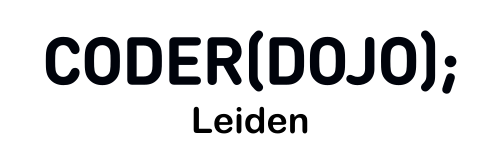
    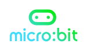
</header>

# Leerlijn micro:bit

Deze pagina bevat een aantal opdrachten, waarmee je leert de micro:bit te programmeren.\
De [micro:bit](https://microbit.org/nl/get-started/what-is-the-microbit/) is een klein computertje, dat je zelf kunt programmeren om van alles te doen!

Voor het programmeren van de micro:bit ga je in een browser naar <a href="https://makecode.microbit.org/#editor" target="_blank">Microsoft MakeCode for micro:bit</a> \
(Het kan zijn dat je daarna nog Nederlands als taal moet selecteren.)

*Zorg ervoor dat je radiokanaal is ingesteld op jouw nummer als je een programma maakt met meerdere micro:bits!*

*De links naar de oplossingen van de opdrachten gaan naar het programma en geven dus "spoilers". Gebruik ze alleen als het je zelf niet lukt om te kijken hoe het wel moet.*

## Makkelijk

    

        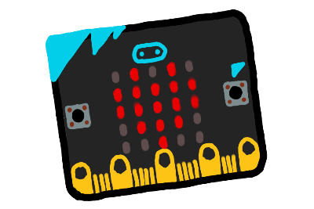
        <h3><a href="opdrachten/makkelijk/knipperend-hart.html">Knipperend hart</a></h3>
        
Begin met deze opdracht!

    

    

        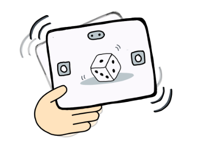
        <h3><a href="opdrachten/makkelijk/dobbelsteen.html">Dobbelsteen</a></h3>
        
Verander de micro:bit in een handige dobbelsteen

    

    

        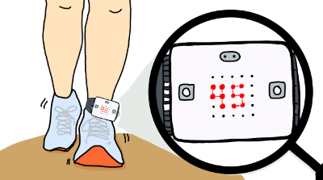
        <h3><a href="opdrachten/makkelijk/stappenteller.html">Stappenteller</a></h3>
        
Verander de micro:bit in een stappenteller

    

## Gemiddeld

    

        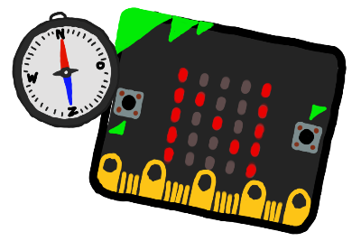
        <h3><a href="opdrachten/gemiddeld/kompas.html">Kompas</a></h3>
        
Maak van je micro:bit een kompas

    

    

        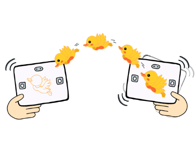
        <h3><a href="opdrachten/gemiddeld/teleporterende-eend.html">Teleporterende eend</a></h3>
        
Laat een eend door de lucht vliegen met radiosignalen

    

    

        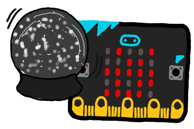
        <h3><a href="opdrachten/gemiddeld/sneeuwbol.html">Sneeuwbol</a></h3>
        
Schud je micro:bit en laat sneeuwvlokjes vallen

    

    

        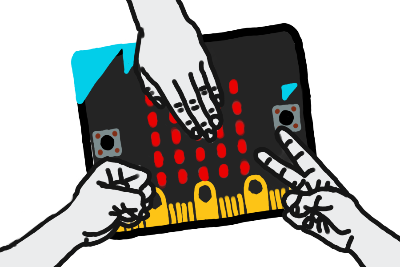
        <h3><a href="opdrachten/gemiddeld/steen-papier-schaar.html">Steen, papier, schaar</a></h3>
        
Speel steen, papier, schaar tegen je micro:bit

    

## Extra moeilijk

    

        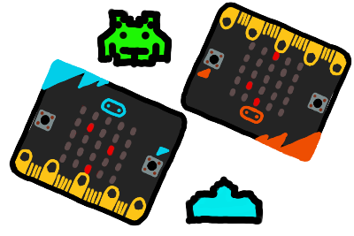
        <h3><a href="opdrachten/moeilijk/schietspel.html">Schietspel</a></h3>
        
Maak een schietspel

    

    

        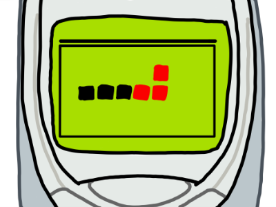
        <h3><a href="opdrachten/moeilijk/snake.html">Snake spel</a></h3>
        
Maak het klassieke spelletje Snake

    

### Bronvermelding

Een deel van deze opdrachten zijn gebaseerd op opdrachten van Lukas Potters.
Dit werk valt onder een <a rel="license" href="http://creativecommons.org/licenses/by-nc-sa/4.0/deed.nl">Creative Commons Naamsvermelding-NietCommercieel-GelijkDelen 4.0 Internationaal-licentie</a>.\

Een deel van deze opdrachten zijn gebaseerd op de [opdrachten van de Raspberry Pi Foundation](https://projects.raspberrypi.org/nl-NL/pathways/microbit-intro).

Een deel van deze opdrachten zijn gebaseerd op de [opdrachten van Microsoft Make:code](https://makecode.microbit.org/projects) en de [opdrachten van de Micro:bit Foundation](https://microbit.org/projects/make-it-code-it/).
