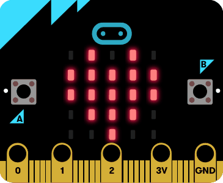

# Hoe werkt het?

Welkom bij de micro:bit opdrachten!

Als eerste opdracht ga je een knipperend hart maken. Dat is een goede manier om te leren hoe je een programma op de micro:bit zet.

1. Open Google Chrome en ga naar <strong><a href="https://makecode.microbit.org" target="_blank">makecode.microbit.org</a></strong>.
1. Sleep blokken uit de lades naar het vlak in het midden van het scherm. Hier klik je je programma in elkaar.
1. Op de micro:bit simulator aan de linkerkant kun je zien wat je programma doet.
1. Wanneer je je programma op een echte micro:bit wilt draaien, druk je op de knop **downloaden**{: .inlineblock.download }  en volg je de instructies!

Gebruik je geen Google Chrome? Dan kun je je micro:bit programma downloaden als een **HEX-bestand**.
In de Windows-verkenner of de macOS Finder, kun je het vervolgens kopiëren naar de micro:bit.

# Maak het

Je kunt blokjes `toon lichtjes`{: .inlineblock.basic } of `toon pictogram ...`{: .inlineblock.basic } gebruiken om lichtjes op de micro:bit aan te zetten.

Zet meerdere van deze blokjes achter elkaar in een `de hele tijd`{: .inlineblock.basic } blok en gebruik ook `pauzeer (ms) ...`{: .inlineblock.basic } om een veranderende afbeelding te maken.

Je kunt ook `wanneer knop ... wordt ingedrukt`{: .inlineblock.input } of `bij ...`{: .inlineblock.input } gebruiken om een andere afbeelding te laten zien bij verschillende inputs.

Het moet er uiteindelijk zo uit zien:

De oplossing kun je <a href="https://makecode.microbit.org/S34732-06030-08826-09878" target="_blank">hier</a> vinden.

# Verder programmeren

* Kun je meer verschillende knipperende patronen bedenken? Wat voor coole animaties kun je daarmee maken?
