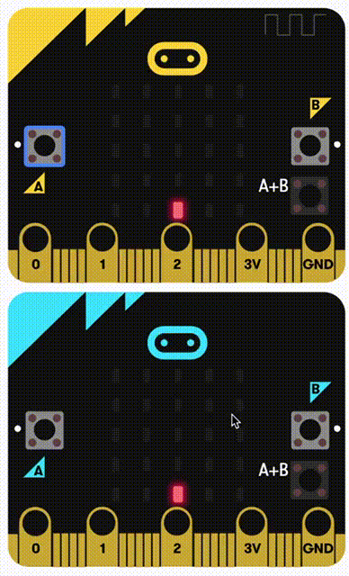

**Let op:** dit is een moeilijke opdracht!

# Hoe werkt het?

Het schietspel speel je met twee micro:bits die draadloos communiceren met elkaar communiceren. De spelregels zijn als volgt:

Iedere speler bedient een 'poppetje', en die heeft drie levens. Het poppetje is één pixel die van links naar rechts mag bewegen op de onderste rij van het scherm van zijn/haar micro:bit.

Wanneer de speler A en B tegelijk indrukt, wordt er een kogel afgeschoten. Die gaat recht omhoog vanaf de plek van het poppetje, totdat hij de bovenrand van het scherm raakt. Op dat moment 'vliegt' de kogel draadloos naar het scherm van de **andere speler**. 

Daar verschijnt de kogel aan de bovenkant en valt hij naar beneden. De andere speler moet dan snel zijn poppetje naar links of rechts bewegen, om de kogel te ontwijken.

*De opdracht gaat verder onder het filmpje.*

# Maak het

- Zorg dat je kunt bewegen met A en B.
- Zorg dat je kunt schieten door A en B in te drukken of dat je schudt om te schieten.
- Zorg dat als je schiet een kogel vooruit gaat en over gaat naar het andere scherm.
- Als de kogel je raakt, verlies je een leven en als je geen levens meer hebt ben je af.
- Zorg dat je eventueel kan herstarten als je af bent.

De oplossing vind je <a href="https://makecode.microbit.org/_6YRXx0CyXWDY" target="_blank">hier</a>.
