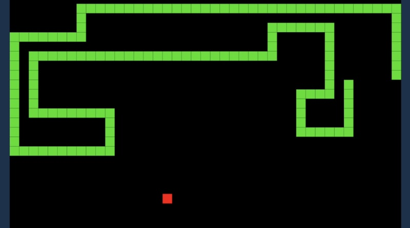

Het spelletje snake ken je misschien van oude Nokia mobieltjes. :) 

# Hoe werkt het?

In het spel bestuur je een lijn die over het scherm beweegt, dat is de slang. Het doel is om de slang te laten groeien door hem telkens naar het blokje eten te sturen.
De slang wordt één blokje langer iedere keer dat hij iets eet. Maar de slang mag niet tegen zichzelf botsen, dan is het spel voorbij.
Wanneer de slang door de rand van het scherm gaat, gaat hij door aan de tegenovergestelde kant van het scherm.

# Maak het

Aangezien dit een moeilijke opdracht is, krijg je wat minder uitleg :)

Je moet een aantal dingen bijhouden in **variabelen**. De belangrijksten zijn:

* De plek waar het eten ligt (x en y).
* De plekken van ieder stukje van de slang (x en y). Hier kun je een **lijst** voor gebruiken.
* De richting waar de slang heen gaat.

Om de zoveel tijd moet je de slang een stapje laten zetten.
Na ieder stapje, controleer je of de slang zichzelf raakt, dan weet je of het _game over_ is.

Je kunt de knoppen A en B gebruiken om de speler de slang van richting te laten veranderen:

* Bij het indrukken van A verandert de richting van de slang een kwartslag tegen de klok in.
* Bij het indrukken van B verandert de richting van de slang een kwartslag me de klok mee.

De oplossing vind je <a href="https://makecode.microbit.org/S07512-61839-99586-38678" target="_blank">hier</a>. 

# Verbeter het

* Kun je een geluidje toevoegen wanneer het game over is, en de score laten zien?
* Kun je de slang laten bedienen door de micro:bit te bewegen / te kantelen?
